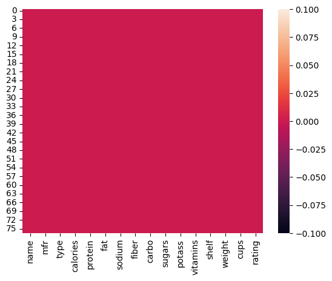
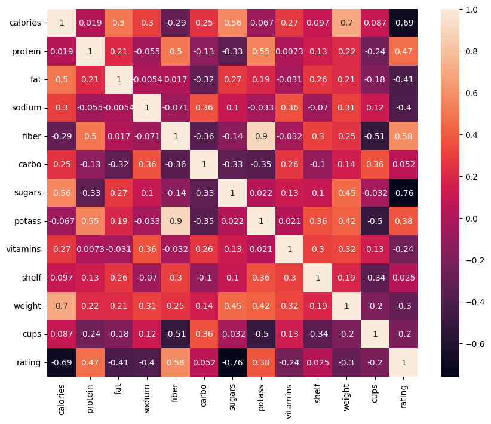
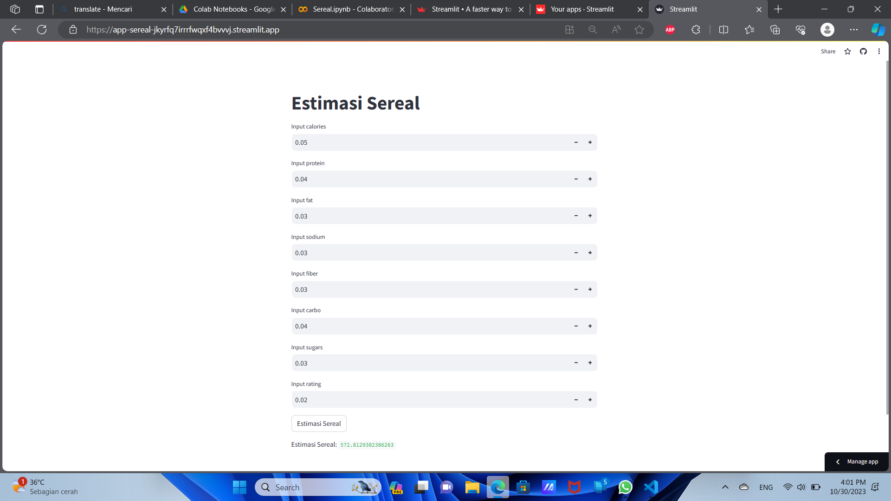

# Laporan Proyek Machine Learning
### Nama : Muhammad Nizar Amirullah
### Nim : 211351096
### Kelas : Pagi A

## Domain Proyek

Sebuah penelitian yang mencakup pengumpulan data dan analisis terkait dengan 80 jenis sereal yang berbeda. Proyek ini bertujuan untuk mengidentifikasi karakteristik, rasa, bahan-bahan, dan kandungan gizi dari berbagai jenis sereal yang tersedia di pasar.

## Business Understanding

Bisa untuk memberikan informasi berguna kepada konsumen, produsen, dan peneliti tentang karakteristik dan kandungan gizi sereal.

## Problem Statements

- Untuk menganalisis dan membandingkan kandungan gizi dari 80 jenis sereal yang berbeda.

## Goals

- Mencari solusi untuk memudahkan menghitung jumlah kalium yang terkandung dalam setiap porsi dari masing-masing jenis sereal.

## Solution statements
- Pengembangan Platform 80 cereal Berbasis Web, Solusi pertama adalah mengembangkan platform analisis Sereal yang mengintegrasikan data dari Kaggle.com untuk memberikan pengguna akses mudah untuk menganalisis sereal.

## Data Understanding
Dataset yang saya gunakan berasal dari Kaggle.<br> 

[80 Cereals](https://www.kaggle.com/datasets/crawford/80-cereals).

## Variabel-variabel pada 80 cereals adalah sebagai berikut:

calories : satuan yang digunakan untuk mengukur jumlah energi yang diperoleh atau digunakan oleh tubuh dari makanan dan minuman yang dikonsumsi.

protein : nutrisi penting yang berperan dalam banyak fungsi biologis yang krusial dalam tubuh manusia.

fat : komponen gizi yang penting untuk kesehatan dan fungsi tubuh.

sodium : salah satu unsur kimia esensial yang ditemukan dalam tubuh manusia.

fiber :  bagian dari tanaman yang tidak dapat dicerna oleh sistem pencernaan manusia karena manusia tidak memiliki enzim yang diperlukan untuk memecah serat.

carbo : sumber utama energi untuk tubuh manusia.

sugars : sumber utama rasa manis dalam makanan dan minuman yang dikonsumsi oleh manusia.

rating : memberi penilaian terhadap kualitas atau kinerja suatu produk, layanan, acara, atau entitas tertentu. 

## Data Preparation
### Data Collection
Untuk data collection ini, saya mendapatkan dataset yang nantinya digunakan dari website kaggle dengan nama dataset 80 cereals, jika anda tertarik dengan datasetnya, anda bisa click link diatas.

## Data Discovery And Profiling
Untuk bagian kolom ini kita tambahkan libary terlebih dahulu

```bash
import numpy as np
import pandas as pd
import matplotlib.pyplot as plt
import seaborn as sns
```
Karna kita pakai google coleb,kita pake script seperti yang di bawah,nanti kita tinggal upload file kaggle.json nya.

```bash
from google.colab import files
files.upload()
```

Setelah mengupload filenya, maka kita akan lanjut dengan menyimpan file kaggle.json yang sudah diupload tadi
```bash
!mkdir -p ~/.kaggle
!cp kaggle.json ~/.kaggle/
!chmod 600 ~/.kaggle/kaggle.json
!ls ~/.kaggle
```

Dan setelah itu kita download dataset terlebih dahulu.

```bash
!kaggle datasets download -d crawford/80-cereals
```

Setelah download file dataset tadi kita akan Meng Extract file dataset yang telah kita download tadi

```bash
!unzip 80-cereals.zip -d cereals
!ls cereals
```

Klik file yang telah di extract lalu salin file csv nya dengan nama Copy path atau salin jalur dan paste di bawah ini

```bash
df = pd.read_csv('cereals/cereal.csv')
```

kita akan melihat dataset

```bash
df.head()
```

Selanjutnya kita akan memeriksa datasetsnya

```bash
df.info()
```

```bash
sns.heatmap(df.isnull())
```


```bash
df.describe()
```

Mari kita lanjut dengan data exploration

```bash
plt.figure(figsize=(10,8))
sns.heatmap(df.corr(),annot=True)
```

```bash
df.isna().sum()
```

## Feature

Memasukkan kolom-kolom fitur yang ada di datasets dan juga kolom targetnya

```bash
features = ['calories','protein','fat','sodium','fiber','carbo','sugars','rating']
x = df[features]
y = df['potass']
x.shape, y.shape
```

```bash
x_train, X_test, y_train, y_test = train_test_split(x,y,random_state=70)
y_test.shape
```

## Modeling

sebelumnya mari kita import library yang nanti akan digunakan

```bash
lr = LinearRegression()
lr.fit(x_train,y_train)
pred = lr.predict(X_test)
```

```bash
score = lr.score(X_test, y_test)
print('akurasi model regresi linier = ', score)
```

```bash
input_data = np.array([[70,4,1,260,9,7,5,3]])

prediction = lr.predict(input_data)
print('Estimasi nilai potass di dalam cereal :', prediction)
```
akurasi model regresi linier =  0.9248463099700517


sekarang modelnya sudah selesai, mari kita export sebagai sav agar nanti bisa kita gunakan pada project web streamlit kita
```bash
import pickle

filename = 'Sereal.sav'
pickle.dump(lr,open(filename,'wb'))
```

## Evaluation

Disini saya menggunakan rumus RMSE sebagai berikut:

 Root Mean Squared Error (RMSE) dapat memberikan gambaran tentang sejauh mana model regresi linear cocok dengan data aktual. 

 Rumus: 

 RMSE = sqrt(Σ(y_actual - y_pred)^2 / n)
 ```bash
 from sklearn.metrics import r2_score
from sklearn.metrics import mean_squared_error

print('R2:', r2_score(y_test,pred))
print('RMSE:', np.sqrt(mean_squared_error(y_test, pred)))
```
RMSE: Root Mean Squared Error.<br>
y_actual: Data aktual (nilai sebenarnya).<br>
y_pred: Data hasil prediksi dari model regresi linear.<br>
n: Jumlah total titik data.

## Deployment

[Estimasi Cereals](https://app-sereal-jkyrfq7irrrfwqxf4bvvvj.streamlit.app/)


